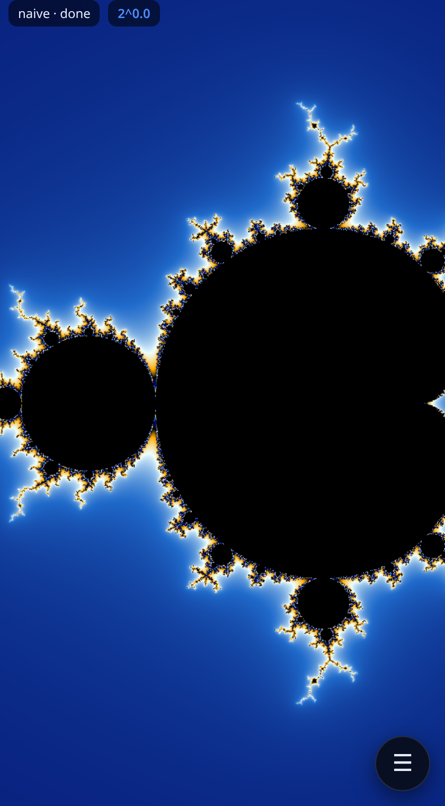

# Mandelbrot Deep Zoom

A mobile-first Mandelbrot viewer that zooms past the limits of double precision
using **perturbation theory** with **Zhuoran rebasing** for glitch-free deep
zoom, rendered on the **GPU** with WebGL2 shaders. Pure JS + HTML + CSS, no build
step. Every engine is validated against a BigInt-exact oracle (CPU engine to
**2^400**; GPU engines vs the CPU/BigInt oracle from the home view down to
**~2^-340** via a floatexp shader). Point-filtered + **supersampled** for a crisp,
anti-aliased "ultra" look.



## Try it

```bash
npm install        # Playwright 1.61.0 (for the e2e tests)
npm run serve      # http://127.0.0.1:8137
```

Open the URL on a phone or in a browser. **Click / tap anywhere to recenter there
and zoom in** (shift / ctrl / right-click to zoom out); pinch / drag to zoom and
pan; scroll-wheel zooms about the cursor on desktop. While you zoom, the current
image is scaled as a live preview and the sharp re-render kicks in once the motion
settles. The ☰
button opens controls: iteration count (slider + a number field for exact values),
**supersampling** (Off / 2× / 3× / 4× anti-aliasing), palettes, a precise
coordinate box, and shareable deep-zoom links. The image is **point-filtered**
(crisp, not bilinear-blurry) when scaled to the screen and during zoom gestures.

## How it works

The maths is perturbation theory; the per-pixel work runs in **WebGL2 fragment
shaders** (`src/gpu/`). The high-precision **reference orbit** is computed once on
the CPU in BigInt fixed-point (`src/math/bignum.js`, `reference.js`) and uploaded
as a texture; the GPU then solves every pixel by the **delta iteration**
`δ' = 2·Z·δ + δ² + δc` with **Zhuoran rebasing** (glitch-free from one reference).

The engine is dispatched by zoom depth (`gpuEngineForRadius` in `render.js`):

| radius | engine | precision |
|---|---|---|
| ≥ 2⁻² | GPU **naive** | float32 (shallow; whole-set view) |
| 2⁻² … 2⁻¹¹² | GPU **perturbation** | **df64** (double-single, ~46-bit) reference + deltas |
| 2⁻¹¹² … 2⁻³⁴⁰ | GPU **perturbation** | **floatexp**-precision (df64 mantissa + int exponent), via the faster **rescaled** engine — the deep / **~2²⁷⁰** path |
| < 2⁻³⁴⁰ or GPU off | CPU **perturbation** | double (the validated oracle, to 2^400) |

Why df64 for the deep GPU path: plain float32 perturbation looks fine until the
iteration count climbs, then the float32 reference's reconstruction error
(`z = Z + δ`, ~2⁻²⁴) amplifies on chaotic boundary pixels and 10–30 % of them go
wrong. Double-single arithmetic (two float32 ≈ 46-bit) cuts that to <1 % — within
the genuine 46- vs 53-bit gap on measure-zero pixels.

Why **floatexp** below 2⁻¹¹²: df64 widens the mantissa but keeps float32's exponent,
so the per-pixel offset `δc ~ 2⁻²⁷⁰` underflows (min normal 2⁻¹²⁶) and the df64 path
floors at ~2⁻¹¹². The floatexp engine stores each small delta as a df64 mantissa
**plus a separate int exponent** (`m·2ᵉ`), keeping the 46-bit precision while the
exponent reaches the full double range — so the GPU renders ~2²⁷⁰ zooms. The
reference orbit stays df64 (it's O(1)); only the deltas carry the exponent. (Details
+ the BigInt arbiter that proved the residual is precision, not a bug, in `NOTES.md`.)

Why **rescaled** for that band's speed: floatexp carries a separate exponent on every
delta component and renormalizes after *every* arithmetic op. The rescaled engine
instead gives the delta `δz = (δx,δy)` **one shared exponent** so the per-iteration
update runs in plain df64 and renormalizes once — ~1.3× faster on the worst-case
chaotic valley (more on smooth regions / real GPUs) at the **same precision** (it still
does the escape/rebase test in exact floatexp, so the glitch-free rebase decision is
identical). `validate-gpu` gates it against the CPU oracle at the same thresholds as
floatexp; `floatexp` stays in the renderer as the reference and a one-line fallback.

**Supersampling** computes the fractal at ss× the display resolution and box-averages
the subsample *colors* down (averaging the cyclic smooth-count would bleed hues);
the display→screen scale stays point-filtered so the result is crisp, not blurry.

Coloring is in-shader from a CPU-baked palette LUT (no readback), so palette and
color-cycle changes are instant. A **Web Worker** computes the reference off the
main thread. Turn the GPU off in the controls to fall back to the CPU worker pool.

**Strip-tiled deep render**: past ~2²¹⁸ a frame needs ~55k iterations, and a single
GPU draw at that count runs long enough to trip the GPU **watchdog** (TDR) on real
hardware — the practical reason deep zooms used to hang. The escape pass is split into
short horizontal **strips** drawn one at a time (scissor), yielding between them, so no
single draw exceeds the watchdog; the image reveals top-to-bottom and any zoom cancels
it instantly. It's **bit-identical** to one big draw (the scissor keeps `gl_FragCoord`
global). Measured separately: the deep engines match the CPU oracle to **0.000%** out to
2⁻²⁷¹ — the 2²¹⁸ wall was the watchdog, not precision.

See `NOTES.md` for the math, precision analysis, and design decisions, and
`AGENDA.md` for status and what's next (real-device check of the strip-tiled deep zoom;
auto-supersample-drop at extreme depth; a cheaper escape/rebase block).

## Correctness & tests

- `npm test` — 31 Node unit tests. The key ones compare the perturbation engine
  against a **BigInt-exact oracle** (`escapeBigInt`) pixel-for-pixel at
  2⁴⁵, 2¹²⁰, 2¹⁰⁰ and **2⁴⁰⁰** (±1 iteration, the floating-point boundary limit);
  plus the floatexp split round-trip (to 2⁻³⁴⁰) and the depth→engine dispatch.
- `npm run e2e` — Playwright suite (mobile + desktop): loads, renders, pans,
  zooms, **click-to-zoom** (recenter + zoom, real-mouse wiring), deep-zoom-by-
  coordinate, palette recolor, URL-hash round-trip, deterministic golden
  fingerprint, glitch-free perturbation, **point-filter + supersampling**, plus a
  **GPU suite** (WebGL2 present, GPU-vs-oracle match at home and deep, engine
  dispatch, CPU fallback).
- `npm run bench:gpu` — times the floatexp vs **rescaled** perturbation shaders on
  this host's GL (the rescaled engine is ~1.26× faster on the worst-case chaotic
  valley; Spawn 5's earlier wins were ~2× fe, ~2.4× df64).
- `npm run crosscheck:skip` — proves the perturbation **fast-skip** is bit-identical
  (renders each view with the skip on AND off → 0-diff full image, all three engines).
- `npm run crosscheck:tiled` — proves the **strip-tiled** deep render is bit-identical to
  a single full-frame draw (0-diff across naive/df64/fe/rescaled, all depths incl. 2⁻²¹⁸,
  strip heights from 1 row to larger-than-frame). The gate for the "zoom past 2²¹⁸" fix.
- `npm run probe:rescaled` — checks the rescaled engine vs the CPU oracle and vs floatexp.
- `npm run probe:deep218` — measures deep **chaotic** GPU-vs-oracle mismatch at 2⁻⁹⁰…2⁻²⁷¹
  on a real deep coordinate (it's 0.000% — confirming the 2²¹⁸ wall was the watchdog, not
  precision).
- `npm run validate:gpu` — the canonical GPU regression: renders the GPU naive /
  df64 / **floatexp** / **rescaled** perturbation engines headless (SwiftShader) and
  compares to the CPU/BigInt oracle across 2⁰ … 2⁻³⁴⁰, gating on bulk-agreement metrics.
  `npm run smoke:gpu` drives the real app and checks GPU↔CPU parity + captures
  screenshots; `node tools/shoot-ss.mjs` captures a supersampling off-vs-4× pair.

> NixOS note: the Playwright-bundled Chromium can't run here; the config uses a
> nix-store Chromium with `--headless=new`. Details in `NOTES.md`.

## Project layout

```
index.html, styles.css      mobile-first UI
src/main.js                 UI wiring, status, URL-hash bookmarks
src/viewer.js               canvas, HP view state, gestures, GPU/CPU dispatch
src/worker.js               reference-orbit + CPU render worker
src/palette.js              smooth-count -> RGB (+ GPU LUT helper)
src/gpu/glsl.js             GLSL shaders (naive f32/df64, perturb f32/df64, color)
src/gpu/renderer.js         WebGL2 renderer (programs, float FBO, reference texture)
src/gpu/validate.js         GPU-vs-oracle comparison (naive / perturb / BigInt arbiter)
src/math/naive.js           double-precision oracle
src/math/bignum.js          fixed-point BigInt reals (decimal/double IO)
src/math/reference.js       high-precision reference orbit + BigInt-exact oracle
src/math/perturb.js         perturbation delta iteration + rebasing
src/math/render.js          reference auto-selection + full render + engine dispatch
test/unit/*.test.mjs        node --test correctness suite
test/e2e/*.spec.mjs         Playwright integration tests (incl. gpu.spec.mjs)
test/gpu/harness.html       in-browser GPU validation harness
tools/serve.mjs             static dev server (COOP/COEP)
tools/validate-gpu.mjs      GPU-vs-oracle depth sweep   ·  tools/arbiter-gpu.mjs (BigInt arbiter)
tools/smoke-viewer.mjs      drive the app + GPU/CPU parity  ·  tools/probe-webgl.mjs (caps)
tools/shoot.mjs             screenshot capture
```
